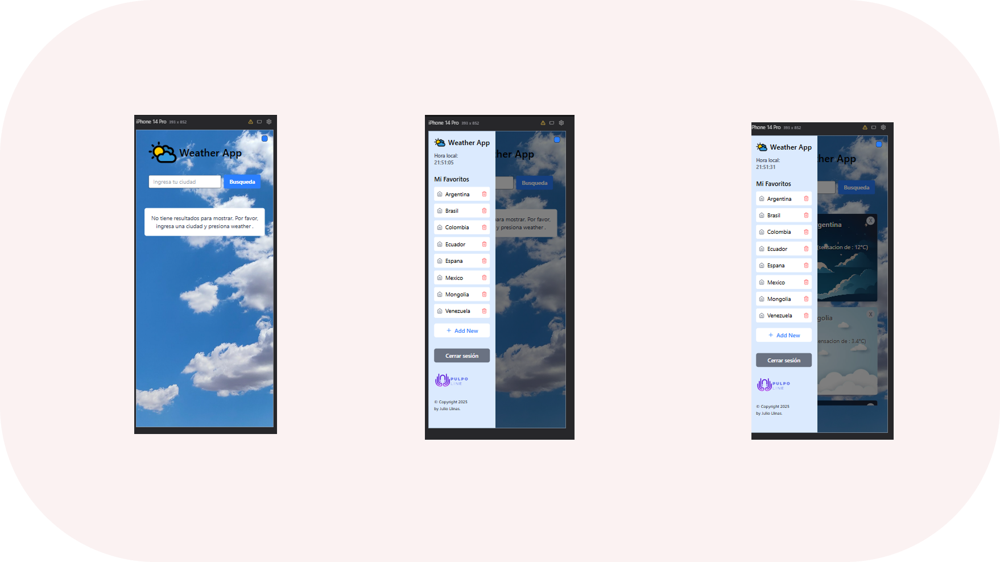

# Weather App


## Descripción

Weather App es una aplicación web que permite a los usuarios buscar el pronóstico del tiempo para diferentes ciudades. Los usuarios pueden añadir ciudades a su lista de favoritos para un acceso rápido y ver el historial de sus búsquedas recientes. La aplicación también incluye un sistema de autenticación para guardar las ciudades favoritas de cada usuario.

## Tecnologías Utilizadas

* **Frontend:**
    * [React](https://react.dev/): Librería de JavaScript para construir interfaces de usuario.
    * [Tailwind CSS](https://tailwindcss.com/): Framework de CSS utility-first para un diseño rápido y personalizado.
    * [React Router](https://reactrouter.com/): Para la navegación entre diferentes secciones de la aplicación (aunque en esta versión parece ser una SPA con componentes condicionales).
    * [React Context API](https://react.dev/learn/passing-data-deeply-with-context): Para la gestión del estado global de la aplicación.
    * [Axios](https://axios-http.com/): Cliente HTTP basado en promesas para realizar peticiones a la API del clima y los servicios de autenticación/favoritos.
    * [React Toastify](https://react-toastify.js.org/): Para mostrar notificaciones y mensajes de retroalimentación al usuario.
    * [Heroicons](https://heroicons.com/): Conjunto de iconos SVG para la interfaz de usuario.

* **Backend :**
    *  API para:
        * Obtener datos del clima para una ciudad.
        * Autenticar usuarios (login y registro).
        * Gestionar la lista de ciudades favoritas de los usuarios (guardar, eliminar, obtener).

## Funcionalidades Principales

* **Búsqueda de Clima:** Los usuarios pueden ingresar el nombre de una ciudad y obtener el pronóstico del tiempo actual.
* **Lista de Favoritos:** Los usuarios registrados pueden añadir ciudades a una lista de favoritos para un acceso rápido a su pronóstico.
* **Historial de Búsqueda:** La aplicación mantiene un historial de las ciudades buscadas recientemente.
* **Autenticación de Usuarios:** Los usuarios pueden crear una cuenta e iniciar sesión para guardar y acceder a su lista de favoritos personalizada.
* **Diseño Responsive:** La interfaz de usuario se adapta a diferentes tamaños de pantalla, incluyendo dispositivos móviles, tabletas y escritorios. *(Añadir detalles y capturas de pantalla en la sección correspondiente)*
* **Notificaciones:** Se utilizan notificaciones (`react-toastify`) para informar a los usuarios sobre el éxito o los errores en las operaciones (inicio de sesión, registro, cierre de sesión, errores de búsqueda, etc.).

## Cómo Levantar la Aplicación

Sigue estos pasos para ejecutar la aplicación localmente:

1.  **Clonar el repositorio (si aún no lo has hecho):**
    ```bash
    git clone https://github.com/jhonshua/frontend_technical_test.git
  
    ```

2.  **Instalar las dependencias del frontend:**
    ```bash
    cd frontend  
    npm install
    # o
    yarn install
    ```

3.  **Configurar las variables de entorno:**
    * Crea un archivo `.env.local` en la raíz de tu carpeta `frontend`.
    * Agrega las siguientes variables de entorno 

4.  **Iniciar la aplicación en modo desarrollo:**
    ```bash
    npm start
    # o
    yarn start
    ```

    Esto debería abrir la aplicación en tu navegador en `http://localhost:3000`.


## Estructura del Proyecto (Frontend)

  ```bash
   frontend/
├── public/
│   └── index.html
│   └── ... (otros archivos públicos)
├── src/
│   ├── assets/
│   │   ├── logo.png
│   │   ├── cielo.jpg
│   │   └── ... (otras imágenes)
│   ├── components/
│   │   ├── CityInput.jsx
│   │   ├── FavoritesList/
│   │   │   ├── FavoriteItem.jsx
│   │   │   └── index.jsx
│   │   ├── Icon.jsx
│   │   ├── modal/
│   │   │   └── AuthModal.jsx
│   │   ├── SidebarFooter/
│   │   │   └── index.jsx
│   │   ├── SidebarHeader/
│   │   │   └── index.jsx
│   │   ├── SidebarLeft.jsx
│   │   ├── WeatherCard.jsx
│   │   └── WeatherCardList.jsx
│   ├── context/
│   │   ├── AppContext.jsx
│   │   └── index.jsx
│   ├── hooks/
│   │   └── ... (si hay hooks personalizados)
│   ├── services/
│   │   ├── favoriteServicio.js
│   │   ├── loginService.js
│   │   ├── registerService.js
│   │   └── weatherService.js
│   ├── App.jsx
│   ├── index.js
│   └── ... (otros archivos src)
├── .env.local
├── .gitignore
├── package.json
├── README.md
└── 
   


    **Descripción de las carpetas y archivos clave:**

* `public/`: Contiene el archivo `index.html` y otros assets públicos que no son procesados por Webpack.
* `src/assets/`: Almacena los archivos de recursos como imágenes (logo, fondo).
* `src/components/`: Contiene los componentes de la interfaz de usuario, organizados en subcarpetas según su funcionalidad o ubicación (sidebar, modal, etc.).
* `src/context/`: Contiene el `AppContext` y el `AppProvider` para la gestión del estado global.
* `src/services/`: Contiene las funciones para interactuar con las APIs (clima, autenticación, favoritos).
* `src/App.jsx`: El componente principal de la aplicación.
* `src/index.js`: El punto de entrada de la aplicación React.
* `.env.local`: Archivo para configurar las variables de entorno locales.
* `package.json`: Archivo de configuración de npm (o yarn).
* `README.md`: Este archivo, con la descripción de la aplicación, cómo ejecutarla, etc.


 ```


 ## Modo Responsive



## Capturas de Pantalla


